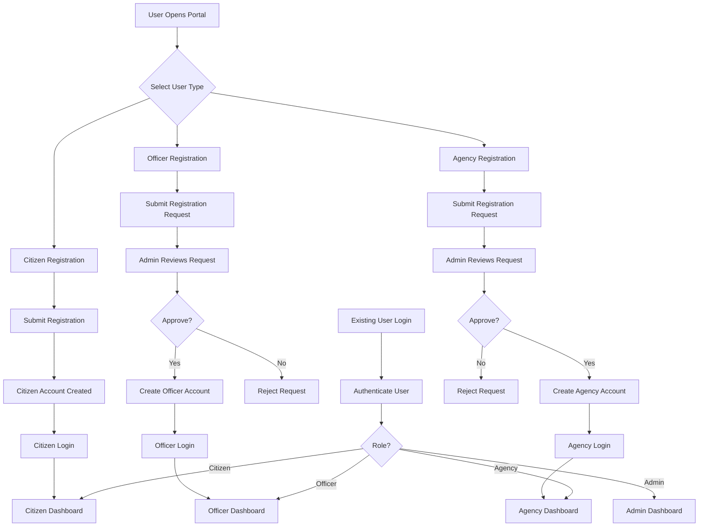
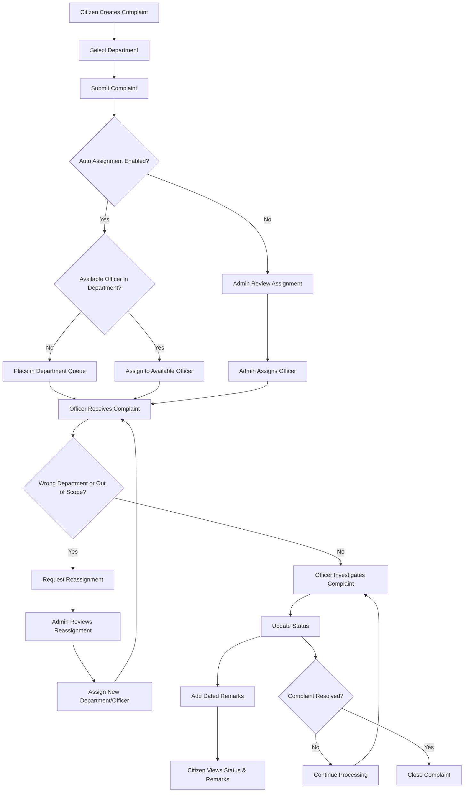
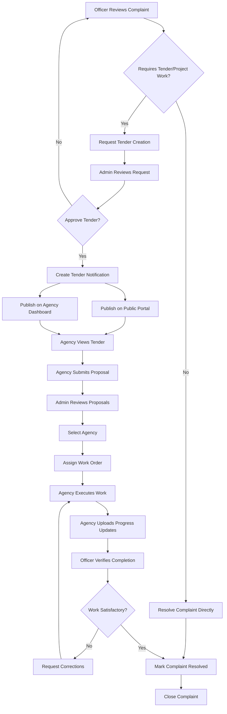

```mermaid
flowchart TD

    A[User Opens Portal]

    A --> B{Select User Type}

    B --> C[Citizen Registration]
    B --> D[Officer Registration]
    B --> E[Agency Registration]

    %% Citizen Flow
    C --> F[Submit Registration]
    F --> G[Citizen Account Created]
    G --> H[Citizen Login]
    H --> I[Citizen Dashboard]

    %% Officer Flow
    D --> J[Submit Registration Request]
    J --> K[Admin Reviews Request]
    K --> L{Approve?}

    L -->|Yes| M[Create Officer Account]
    L -->|No| N[Reject Request]

    M --> O[Officer Login]
    O --> P[Officer Dashboard]

    %% Agency Flow
    E --> Q[Submit Registration Request]
    Q --> R[Admin Reviews Request]
    R --> S{Approve?}

    S -->|Yes| T[Create Agency Account]
    S -->|No| U[Reject Request]

    T --> V[Agency Login]
    V --> W[Agency Dashboard]

    %% Existing Users
    X[Existing User Login]
    X --> Y[Authenticate User]

    Y --> Z{Role?}

    Z -->|Admin| AA[Admin Dashboard]
    Z -->|Officer| P
    Z -->|Agency| W
    Z -->|Citizen| I
```

```mermaid
flowchart TD

    A[Citizen Creates Complaint]
    B[Select Department]
    C[Submit Complaint]

    D{Auto Assignment Enabled?}

    E{Available Officer in Department?}
    F[Assign to Available Officer]
    G[Place in Department Queue]

    H[Admin Review Assignment]
    I[Admin Assigns Officer]

    J[Officer Receives Complaint]

    K{Wrong Department or Out of Scope?}

    L[Request Reassignment]
    M[Admin Reviews Reassignment]
    N[Assign New Department/Officer]

    O[Officer Investigates Complaint]
    P[Update Status]
    Q[Add Dated Remarks]

    R[Citizen Views Status & Remarks]

    S{Complaint Resolved?}

    T[Close Complaint]
    U[Continue Processing]

    A --> B
    B --> C
    C --> D

    D -->|Yes| E
    D -->|No| H

    E -->|Yes| F
    E -->|No| G

    G --> J
    F --> J

    H --> I
    I --> J

    J --> K

    K -->|Yes| L
    L --> M
    M --> N
    N --> J

    K -->|No| O

    O --> P
    P --> Q
    Q --> R

    P --> S

    S -->|No| U
    U --> O

    S -->|Yes| T
```

```mermaid
flowchart TD

    A[Officer Reviews Complaint]

    B{Requires Tender/Project Work?}

    C[Resolve Complaint Directly]
    D[Request Tender Creation]

    E[Admin Reviews Request]

    F{Approve Tender?}

    G[Create Tender Notification]

    H[Publish on Public Portal]
    I[Publish on Agency Dashboard]

    J[Agency Views Tender]
    K[Agency Submits Proposal]

    L[Admin Reviews Proposals]

    M[Select Agency]

    N[Assign Work Order]

    O[Agency Executes Work]

    P[Agency Uploads Progress Updates]

    Q[Officer Verifies Completion]

    R{Work Satisfactory?}

    S[Request Corrections]

    T[Mark Complaint Resolved]

    U[Close Complaint]

    A --> B

    B -->|No| C
    C --> T

    B -->|Yes| D

    D --> E
    E --> F

    F -->|No| A

    F -->|Yes| G

    G --> H
    G --> I

    H --> J
    I --> J

    J --> K

    K --> L

    L --> M

    M --> N

    N --> O

    O --> P

    P --> Q

    Q --> R

    R -->|No| S
    S --> O

    R -->|Yes| T

    T --> U
```